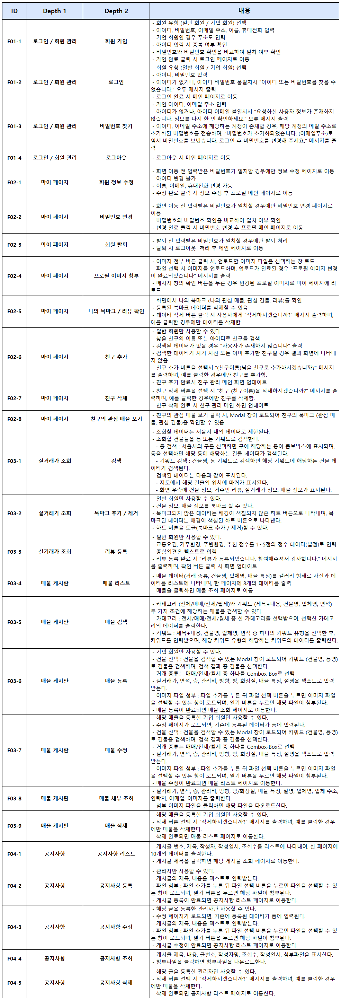
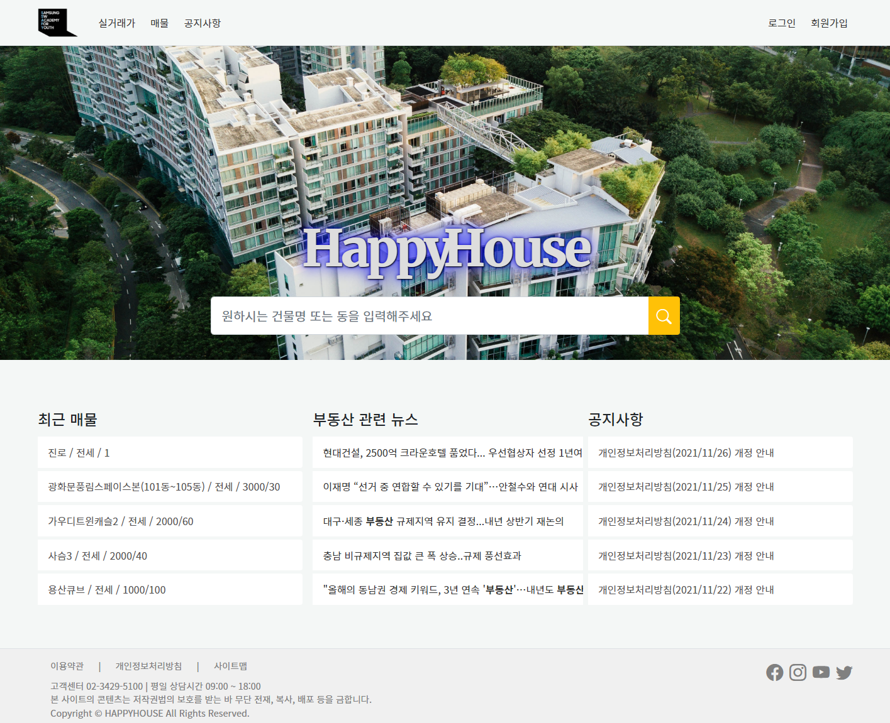

# Happy House
- 삼성 청년 SW 아카데미 6기 Java 트랙 1학기 관통 프로젝트의 결과물입니다.
## 개요
- 부동산 매물의 다양한 서비스 제공을 목적으로 매물 실거래가, 최신 매물 정보, 실거주자 리뷰, 친구 기능 등을 구현하고자 한다.

## 프로젝트 기간
- 2021년 11월 일 ~ 2021년 11월 일

## 성과
- 삼성 청년 SW 아카데미 1학기 프로젝트 최우수상 수상

## 기술 스택

  &nbsp;
  &nbsp;
  &nbsp;
  &nbsp;
  &nbsp;
  &nbsp;
  &nbsp;
  &nbsp;

## 팀원
<table>
  <thead>
    <tr>
      <th>이름</th>
      <th>역할</th>
      <th>구현 기능</th>
    </tr>
  </thead>
  <tbody>
    <tr>
      <td rowspan="2">박대언</td>
      <td rowspan="2">팀장</td>
      <td>Front-End 전반</td>
    </tr>
    <tr>
      <td>Back-End (Rest API 설계, SQL/Spring 디버깅, 이미지 업로드, 매물 조회 게시판 카테고리/키워드 검색 등 필요 API 추가, DB 테이블 수정 등)</td>
    </tr>
    <tr>
      <td rowspan="2">강소현</td>
      <td rowspan="2">팀원</td>
      <td>Back-End 전반</td>
    </tr>
    <tr>
      <td>Front-End (메인 페이지 검색창 수정 및 매물 조회 게시판 디자인)</td>
    </tr>
  </tbody>
</table>

## 주요 기능

## 실행 화면
### 메인 페이지

### 로그인 및 회원가입

회원 분류 (일반 회원 / 기업 회원) 2가지, 아이디 중복체크, 비밀번호 이중 체크

### 공지사항

공지사항 리스트, 글 조회, 작성, 수정, 삭제

### 매물
- 매물 리스트

리스트, 페이지네이션

- 매물 검색

매물 카테고리(매매/전세/월세), 검색 유형에 따른 키워드 검색

- 매물 등록, 상세 조회, 삭제

### 실거래가
- 검색

동(콤보 박스) 또는 키워드 검색에 따른 실거래가 상세 조회

- 리뷰 및 북마크 (관심 건물 / 매물)

실거래가 페이지에서 등록한 리뷰, 북마크 (관심 건물 / 매물)를 마이 페이지에서 확인, 삭제 가능

### 마이 페이지
- 프로필

프로필 사진 등록, 정보 수정 가능

- 친구

친구 추가, 삭제, 친구의 관심 매물 조회 가능 두 계정을 이용하여 팔로워, 팔로잉 변화 확인

