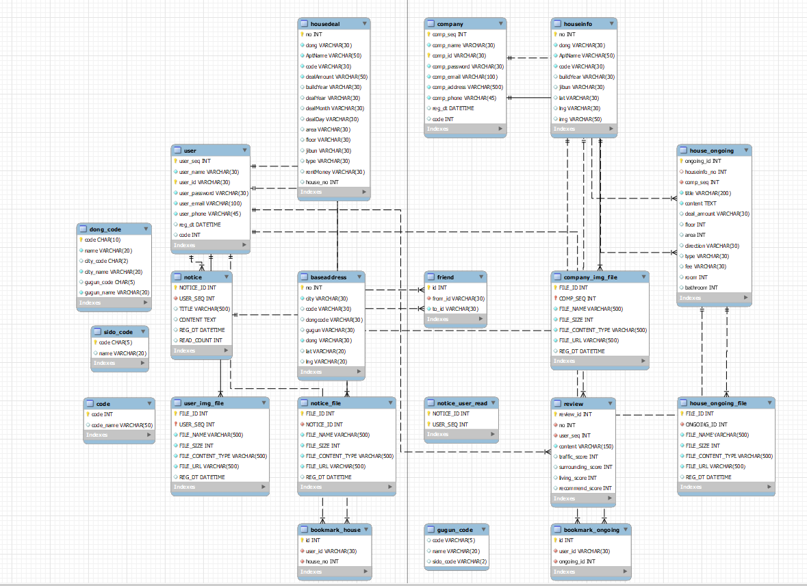
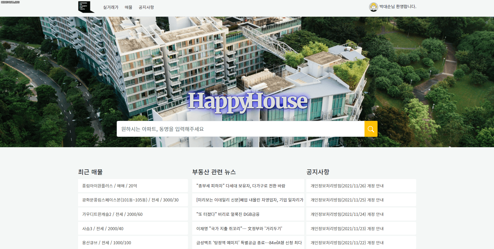

# Happy House

- 삼성 청년 SW 아카데미 6기 Java 트랙 1학기 관통 프로젝트의 결과물입니다.
  
    
  
  ## 개요

- 부동산 매물의 다양한 서비스 제공을 목적으로 매물 실거래가, 최신 매물 정보, 실거주자 리뷰, 친구 기능 등을 구현하고자 한다.
  
    

## 프로젝트 기간

- 2021년 11월 17일 ~ 2021년 11월 26일

 

 

## 성과

- 삼성 청년 SW 아카데미 1학기 프로젝트 최우수상 수상

  

## 기술 스택

   
   
   
   
   
   
   
  

######   

## 팀원

<table>
  <thead>
    <tr>
      <th>이름</th>
      <th>역할</th>
      <th>구현 기능</th>
    </tr>
  </thead>
  <tbody>
    <tr>
      <td rowspan="2">박대언</td>
      <td rowspan="2">팀장</td>
      <td>Front-End 전반</td>
    </tr>
    <tr>
      <td>Back-End (Rest API 설계, SQL/Spring 디버깅, 이미지 업로드, 매물 조회 게시판 카테고리/키워드 검색 등 필요 API 추가, DB 테이블 수정 등)</td>
    </tr>
    <tr>
      <td rowspan="2">강소현</td>
      <td rowspan="2">팀원</td>
      <td>Back-End 전반</td>
    </tr>
    <tr>
      <td>Front-End (메인 페이지 검색창 수정 및 매물 조회 게시판 디자인)</td>
    </tr>
  </tbody>
</table>

  

## **DataBase 설계**

  

## 주요 기능

  

## 실행 화면

### 🔗 메인 페이지 - 뉴스 API

✅ 네이버 뉴스API를 활용하여 부동관 관련 뉴스 리스트로 표시

  

### 🔗 메인 페이지 - 키워드 검색

✅ 동, 건물명 중 검색 키워드 일부 혹은 전체 검색하면 관련 건물을 마커로 표시

  

---

### 🔗 회원가입

✅ 회원 분류 (일반 회원 / 기업 회원) 2가지, 아이디 중복체크, 비밀번호 이중 체크

✅ 비밀번호, 비밀번호 확인이 같지 않으면 비밀번호가 일치하지 않음을 표시

  

### **🔗 비밀번호 찾기**

✅ Commons Email을 활용한 회원 인증을 걸친 후, 임시 비밀번호를 사용자 이메일로 전송

  

---

### 🔗 공지사항

✅ 공지사항 리스트, 글 조회, 작성, 수정, 삭제

  

---

### **🔗 매물 검색 - 동 검색**

✅ 지도는 카카오 MAP API 사용

✅ 시, 구/군, 동 선택하면 그 지역에 존재하는 건물 마커로 표시

  

### **🔗 매물 검색 - 키워드 검색**

✅ 동, 건물명 중 검색 키워드 일부 혹은 전체 검색하면 관련 건물을 마커로 표시

  

### **🔗 관심 건물 - 북마크**

✅ 관심 건물 북마크 표시 후 마이페이지에서 확인

  

### **🔗 관심 건물 - 북마크 해제**

✅ 마이페이지에서 관심 건물 북마크 해제 (실거래가 페이지에서도 해제 가능)

  

### **🔗 리뷰 등록**

✅ 실거주자는 건물에 대한 리뷰 작성이 가능

✅ 교통요건, 거주환경, 주변환경, 총 추천점수, 리뷰 내용 작성

  

### **🔗 리뷰 확인**

✅ 마이페이지에서 리뷰 삭제

  

### **🔗 리뷰 삭제**

  

### **🔗 관심 매물 - 북마크**

✅ 관심 매물 북마크 표시 후 마이페이지에서 확인

  

### **🔗 관심 매물 - 북마크 해제**

✅ 마이페이지에서 관심 매물 북마크 해제 (실거래가 페이지에서도 해제 가능)

  

----

### **🔗 기업회원 - 로그인**

✅ 기업 회원 로그인

✅ 일반 회원, 기업 회원 데이터베이스 분리

  

### **🔗 매물 목록**

✅ 등록된 매물 카드 형식으로 조회

  

### **🔗 매물 조회 - 거래 유형**

✅ 거래 유형(매매 / 전세 / 월세) 으로 분류

  

### **🔗 매물 검색 - 건물명**

✅ 건물명(키워드 일부 혹은 전체) 검색을 통해 매물 조회

  

### **🔗 매물 검색 - 작성자**

✅ 작성자(키워드 일부 혹은 전체) 검색을 통해 매물 조회

  

### **🔗 매물 검색 - 평 수**

✅ 평 수 검색을 통해 관련 매물 조회

  

### **🔗 매물 등록**

✅ 매물 등록(건물 정보, 거래 종류, 실거래가, 해당 층, 면적(평 수), 방향, 관리비, 방, 욕실, 매물 특징, 매물 설정, 매물 이미지)

  

### **🔗 매물 삭제**

✅ 등록된 매물 삭제

  

### **🔗 매물 이미지 확인**

✅ 등록된 매물 이미지 확인 및 다운로드

  

----

### **🔗 마이페이지**

✅ 마이페이지 화면

  

### **🔗 마이페이지 - 친구 관심 매물 확인**

✅ 마이페이지를 통해 팔로워한 친구 관심 매물 확인

  

### **🔗 마이페이지 - 프로필 이미지 변경**

✅ 마이페이지에서 사용자 프로필 이미지 변경

  

### **🔗 마이페이지 - 친구 등록**

✅ 마이페이지에서 친구 추가를 통해 친구를 팔로잉 할 수 있음

  

### **🔗 마이페이지 - 친구 삭제**

✅ 마이페이지에서 나를 팔로워 하는 친구를 삭제할 수 있음

